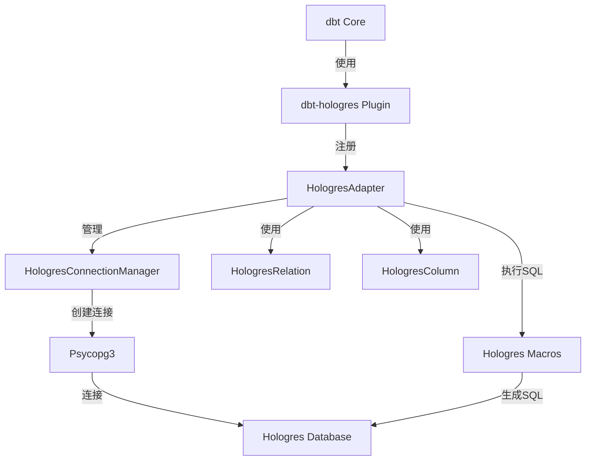
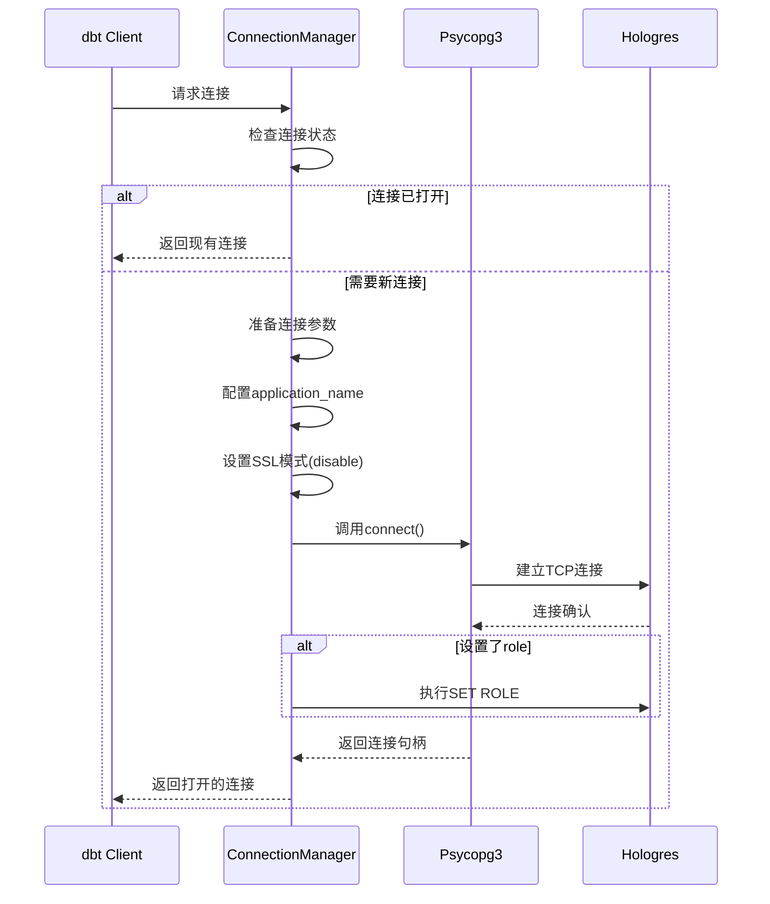
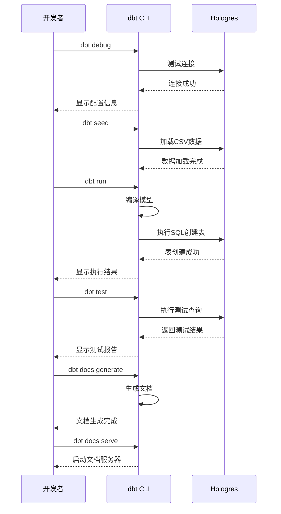

# dbt-hologres 适配器实现设计

## 1. 项目概述

### 1.1 项目目标

为阿里云Hologres数据仓库开发dbt适配器，使dbt能够与Hologres无缝集成，支持数据转换、模型管理和分析工作流程。

### 1.2 技术背景

- Hologres是阿里云推出的兼容PostgreSQL协议的实时数据仓库
- 基于dbt-postgres适配器进行定制化开发
- 使用Psycopg 3作为数据库驱动程序（与dbt-postgres使用的psycopg2有重要区别）
- 需要处理Hologres特定的连接配置和认证机制

### 1.3 核心差异点

相比dbt-postgres，dbt-hologres需要以下关键差异：

1. 数据库驱动：从psycopg2迁移到psycopg3
2. SSL配置：默认不启用SSL模式
3. 应用标识：使用带版本号的application_name（格式：dbt_hologres_{version}）
4. 特定优化：针对Hologres的性能和功能特性进行优化

## 2. 架构设计

### 2.1 项目结构

```
dbt-hologres/
├── src/
│   └── dbt/
│       ├── adapters/
│       │   └── hologres/
│       │       ├── __init__.py          # 适配器插件注册
│       │       ├── __version__.py       # 版本信息
│       │       ├── connections.py       # 连接管理器
│       │       ├── impl.py              # 适配器实现
│       │       ├── column.py            # 列类型定义
│       │       ├── relation.py          # 关系对象定义
│       │       └── relation_configs/    # 关系配置
│       │           ├── __init__.py
│       │           ├── constants.py
│       │           └── dynamic_table.py # 动态表配置
│       ├── include/
│       │   └── hologres/
│       │       ├── __init__.py
│       │       ├── dbt_project.yml      # 项目配置
│       │       ├── profile_template.yml # 配置文件模板
│       │       ├── sample_profiles.yml  # 示例配置
│       │       └── macros/              # SQL宏定义
│       │           ├── adapters.sql
│       │           ├── catalog.sql
│       │           ├── relations/
│       │           │   └── dynamic_table/  # 动态表宏
│       │           └── ...
│       └── __init__.py
├── tests/
│   ├── unit/                            # 单元测试
│   │   ├── test_adapter.py
│   │   ├── test_connection.py
│   │   └── ...
│   ├── functional/                      # 功能测试
│   │   ├── adapter/
│   │   └── ...
│   └── conftest.py                      # pytest配置
├── examples/                            # 使用示例
│   ├── profiles.yml                     # 连接配置示例
│   ├── dbt_project.yml                  # 项目配置示例
│   ├── models/                          # 示例模型
│   └── README.md                        # 使用说明
├── pyproject.toml                       # 项目配置和依赖
├── hatch.toml                           # 构建配置
├── README.md                            # 项目文档
└── CONTRIBUTING.md                      # 贡献指南
```

### 2.2 组件关系图



### 2.3 核心类设计

#### 2.3.1 HologresCredentials

连接凭证数据类，包含以下属性：

| 属性名 | 类型 | 必填 | 默认值 | 说明 |
|--------|------|------|--------|------|
| host | str | 是 | - | Hologres实例主机地址 |
| port | int | 是 | 80 | 端口号，范围0-65535 |
| user | str | 是 | - | 用户名（大小写敏感） |
| password | str | 是 | - | 密码（大小写敏感） |
| database | str | 是 | - | 数据库名称 |
| schema | str | 是 | public | 默认模式 |
| connect_timeout | int | 否 | 10 | 连接超时时间（秒） |
| application_name | str | 否 | dbt_hologres_{version} | 应用程序标识 |
| sslmode | str | 否 | disable | SSL模式，默认禁用 |
| retries | int | 否 | 1 | 连接重试次数 |
| role | str | 否 | None | 数据库角色 |
| search_path | str | 否 | None | 模式搜索路径 |

特殊处理逻辑：
- type属性返回固定值"hologres"
- unique_field使用host作为唯一标识
- 支持别名映射：dbname → database, pass → password
- 连接键包含所有配置参数用于缓存管理

#### 2.3.2 HologresConnectionManager

连接管理器，负责数据库连接的生命周期管理：

**核心职责：**
- 建立和维护与Hologres的数据库连接
- 处理连接异常和重试逻辑
- 执行SQL查询并返回结果
- 管理事务和连接状态
- 取消长时间运行的查询

**关键方法：**

| 方法名 | 功能描述 |
|--------|----------|
| open | 创建新的数据库连接，配置Psycopg3连接参数 |
| cancel | 终止正在运行的查询 |
| exception_handler | 统一异常处理和事务回滚 |
| get_response | 解析查询响应并返回适配器响应对象 |
| add_begin_query | 控制事务开始行为（空实现，使用自动提交） |
| data_type_code_to_name | 将类型代码转换为类型名称 |

**连接建立流程：**



**异常处理策略：**

- 捕获psycopg.DatabaseError并转换为DbtDatabaseError
- 捕获psycopg.OperationalError作为可重试异常
- 使用指数退避策略进行连接重试
- 查询执行失败时自动回滚事务

#### 2.3.3 HologresAdapter

适配器主类，继承自SQLAdapter：

**核心功能：**
- 关系缓存管理
- 目录查询和元数据获取
- 数据库验证
- SQL宏执行
- 增量策略支持

**配置支持：**

| 配置项 | 类型 | 说明 |
|--------|------|------|
| indexes | List[HologresIndexConfig] | 索引配置列表 |
| dynamic_table | HologresDynamicTableConfig | 动态表配置 |

**约束支持矩阵：**

| 约束类型 | 支持级别 | 说明 |
|----------|----------|------|
| NOT NULL | ENFORCED | 强制执行非空约束 |
| UNIQUE | ENFORCED | 强制执行唯一约束 |
| PRIMARY KEY | ENFORCED | 强制执行主键约束 |
| FOREIGN KEY | ENFORCED | 强制执行外键约束 |
| CHECK | ENFORCED | 强制执行检查约束 |

**增量物化策略：**

支持的策略包括：
- append：追加模式，仅插入新记录
- delete+insert：删除后插入，先删除匹配记录再插入
- merge：合并模式，使用MERGE语句进行upsert操作
- microbatch：微批处理模式，适用于时间序列数据

**关键方法：**

| 方法名 | 返回类型 | 功能说明 |
|--------|----------|----------|
| date_function | str | 返回当前时间戳函数："now()" |
| verify_database | str | 验证数据库名称是否与配置匹配 |
| parse_index | Optional[HologresIndexConfig] | 解析索引配置 |
| timestamp_add_sql | str | 生成时间戳加法SQL表达式 |
| valid_incremental_strategies | List[str] | 返回支持的增量策略列表 |
| debug_query | None | 执行简单查询验证连接 |

#### 2.3.4 HologresColumn

列类型定义类，处理Hologres特定的数据类型：

**核心职责：**
- 数据类型表示和转换
- 字符类型长度处理
- 类型名称标准化

**特殊处理：**
- text类型保持原样，不转换为varchar()
- character varying类型无长度限制时保持原类型名
- 其他类型遵循标准列类型处理规则

#### 2.3.5 HologresRelation

关系对象类，表示数据库中的表、视图等对象：

**支持的关系类型：**

| 关系类型 | 可重命名 | 可替换 | 说明 |
|----------|----------|--------|------|
| Table | ✓ | ✓ | 物理表 |
| View | ✓ | ✓ | 视图 |
| DynamicTable | ✗ | ✗ | 动态表（Hologres的物化视图） |

**索引配置管理：**

索引配置变更检测逻辑：
- 比较现有索引与新索引配置
- 识别需要删除的索引（存在于现有配置但不存在于新配置）
- 识别需要创建的索引（存在于新配置但不存在于现有配置）
- 返回有序的变更操作列表（先删除后创建）

**动态表配置管理：**

动态表（Dynamic Table）是Hologres的物化视图实现，提供自动数据刷新能力。

配置变更检测逻辑：
- 比较现有动态表配置与新配置
- 识别刷新策略变更（全量/增量/自动）
- 识别新鲜度要求变更
- 识别分区配置变更
- 识别计算资源配置变更
- 返回变更操作列表

动态表配置类（HologresDynamicTableConfig）：

| 属性名 | 类型 | 必填 | 默认值 | 说明 |
|--------|------|------|--------|------|
| freshness | str | 是 | - | 数据新鲜度，如"30 minutes"、"1 hours" |
| auto_refresh_enable | bool | 否 | true | 是否启用自动刷新 |
| auto_refresh_mode | str | 否 | auto | 刷新模式：full/incremental/auto |
| computing_resource | str | 否 | serverless | 计算资源：local/serverless/warehouse_name |
| base_table_cdc_format | str | 否 | stream | CDC格式：stream/binlog |
| partition_key | str | 否 | None | 分区字段名 |
| partition_type | str | 否 | None | 分区类型：logical/physical |
| partition_key_time_format | str | 否 | None | 分区时间格式 |
| auto_refresh_partition_active_time | str | 否 | None | 活跃分区时间范围 |
| orientation | str | 否 | column | 存储模式：column/row |
| distribution_key | List[str] | 否 | None | 分布键列表 |
| clustering_key | List[str] | 否 | None | 聚簇键列表 |
| event_time_column | List[str] | 否 | None | 事件时间列 |
| bitmap_columns | List[str] | 否 | None | 位图索引列 |
| dictionary_encoding_columns | List[str] | 否 | None | 字典编码列 |
| time_to_live_in_seconds | int | 否 | None | 数据TTL（秒） |
| storage_mode | str | 否 | hot | 存储模式：hot/cold |

刷新模式说明：

| 模式 | 说明 | 适用场景 |
|------|------|----------|
| auto | 自动选择增量或全量刷新 | 推荐默认模式，引擎智能判断 |
| incremental | 仅刷新增量数据 | 数据支持增量识别，提高效率 |
| full | 全量刷新所有数据 | 复杂转换逻辑，无法增量处理 |

分区配置说明：

逻辑分区（推荐）：
- 支持自动分区创建和管理
- 通过partition_key指定分区字段
- 通过partition_key_time_format指定时间格式
- 通过auto_refresh_partition_active_time指定刷新范围
- 系统根据时间自动创建新分区
- 仅刷新活跃时间范围内的分区

支持的分区格式：

| 数据类型 | 支持的格式 |
|----------|------------|
| TEXT/VARCHAR | YYYYMMDDHH24, YYYY-MM-DD-HH24, YYYY-MM-DD_HH24, YYYYMMDD, YYYY-MM-DD, YYYYMM, YYYY-MM, YYYY |
| INT | YYYYMMDDHH24, YYYYMMDD, YYYYMM, YYYY |
| DATE | YYYY-MM-DD |

计算资源配置：

| 资源类型 | 说明 | 适用场景 |
|----------|------|----------|
| serverless | 使用Serverless计算资源 | 默认推荐，弹性伸缩 |
| local | 使用实例本地计算资源 | 稳定负载，资源充足 |
| warehouse_name | 使用指定计算仓库 | Hologres V4.0.7+，资源隔离 |

**名称长度限制：**
- 关系标识符最大长度为63个字符
- 超长名称在初始化时抛出DbtRuntimeError异常

### 2.4 版本管理

版本号定义在__version__.py文件中：

```
初始版本：1.0.0
```

版本号格式遵循语义化版本规范：
- 主版本号：重大变更和不兼容更新
- 次版本号：新增功能，向后兼容
- 修订号：错误修复和小改进

## 3. 连接配置设计

### 3.1 配置文件示例

profiles.yml配置结构：

```
配置项目名称: hologres_project

输出配置:
  开发环境:
    适配器类型: hologres
    主机地址: <Hologres实例endpoint>
    端口: 80
    用户名: BASIC$<username>
    密码: <password>
    数据库: <database_name>
    模式: public
    线程数: 4
    连接超时: 10
    SSL模式: disable
    应用名称: dbt_hologres_1.0.0
    重试次数: 1

  生产环境:
    适配器类型: hologres
    主机地址: <生产实例endpoint>
    端口: 80
    用户名: BASIC$<prod_username>
    密码: <prod_password>
    数据库: <prod_database>
    模式: public
    线程数: 8
    连接超时: 30
    SSL模式: disable

目标环境: 开发环境
```

### 3.2 测试环境配置

测试连接信息：

| 参数 | 值 |
|------|-----|
| host | hgpostcn-cn-wyc4l7i67022-cn-hangzhou.hologres.aliyuncs.com |
| port | 80 |
| database | from_dbt |
| user | BASIC$dbt_user |
| password | Leeyd#1988 |
| sslmode | disable |

**注意事项：**
- 用户名和密码大小写敏感
- 使用BASIC$前缀的用户名格式
- 默认不启用SSL连接

### 3.3 环境变量支持

支持通过环境变量配置敏感信息：

| 环境变量名 | 映射配置项 | 示例 |
|-----------|-----------|------|
| DBT_HOLOGRES_HOST | host | export DBT_HOLOGRES_HOST=xxx.hologres.aliyuncs.com |
| DBT_HOLOGRES_USER | user | export DBT_HOLOGRES_USER=BASIC$dbt_user |
| DBT_HOLOGRES_PASSWORD | password | export DBT_HOLOGRES_PASSWORD=secret |
| DBT_HOLOGRES_DATABASE | database | export DBT_HOLOGRES_DATABASE=my_db |

## 4. 测试策略

### 4.1 单元测试

**测试范围：**

1. 连接管理器测试
   - 连接建立和关闭
   - 连接参数配置
   - 异常处理
   - 重试机制
   - application_name设置
   - SSL模式配置

2. 适配器测试
   - 关系对象操作
   - SQL生成
   - 元数据查询
   - 约束验证
   - 增量策略

3. 凭证测试
   - 参数验证
   - 别名映射
   - 类型转换
   - 连接键生成

4. 列类型测试
   - 数据类型转换
   - 长度处理
   - 特殊类型处理

**测试工具：**
- pytest作为测试框架
- pytest-mock用于mock对象
- pytest-xdist支持并行测试

### 4.2 功能测试

**测试类别：**

1. 基础操作测试
   - 连接和认证
   - 创建、删除表
   - 查询执行
   - 事务管理

2. 模型物化测试
   - table物化
   - view物化
   - incremental物化
   - ephemeral模型
   - dynamic_table物化（Hologres特有）

3. 数据类型测试
   - 基本数据类型
   - 复杂数据类型
   - 类型转换

4. 增量更新测试
   - append策略
   - delete+insert策略
   - merge策略
   - microbatch策略

5. 约束测试
   - 主键约束
   - 外键约束
   - 唯一约束
   - 非空约束
   - 检查约束

6. 索引测试
   - 创建索引
   - 删除索引
   - 索引配置变更

7. 动态表测试
   - 创建动态表
   - 自动刷新机制
   - 刷新模式切换（full/incremental/auto）
   - 逻辑分区动态表
   - 手动刷新操作
   - 配置修改操作
   - 计算资源配置

**测试环境：**
- 使用提供的Hologres测试实例
- 在test.env文件中配置测试连接信息
- 通过pytest-dotenv自动加载环境变量

### 4.3 集成测试

**测试场景：**

1. 端到端工作流
   - dbt init项目初始化
   - dbt debug连接验证
   - dbt run模型执行
   - dbt test测试执行
   - dbt seed数据加载

2. 多模型依赖
   - 模型引用关系
   - 依赖顺序执行
   - 增量模型更新

3. 并发执行
   - 多线程模型执行
   - 连接池管理
   - 死锁处理

### 4.4 性能测试

**测试指标：**

| 测试项 | 目标指标 | 测试方法 |
|--------|---------|----------|
| 连接建立时间 | < 2秒 | 100次连接平均时间 |
| 简单查询响应 | < 100ms | SELECT 1查询延迟 |
| 批量插入性能 | > 1000 rows/s | 插入10000行测量吞吐 |
| 模型编译时间 | < 5秒 | 100个模型编译时间 |
| 增量更新效率 | < 10秒 | 1000行增量更新时间 |

## 5. SQL宏实现

### 5.1 适配器宏

**必需实现的宏：**

| 宏名称 | 功能描述 | 返回类型 |
|--------|----------|----------|
| hologres__create_table_as | 创建表并插入数据 | SQL语句 |
| hologres__create_view_as | 创建视图 | SQL语句 |
| hologres__create_dynamic_table_as | 创建Hologres动态表 | SQL语句 |
| hologres__drop_relation | 删除关系对象 | SQL语句 |
| hologres__truncate_relation | 清空表数据 | SQL语句 |
| hologres__rename_relation | 重命名关系对象 | SQL语句 |
| hologres__get_columns_in_relation | 获取列信息 | 列定义列表 |
| hologres__list_relations_without_caching | 列出模式中的关系 | 关系列表 |
| hologres__check_schema_exists | 检查模式是否存在 | 布尔值 |
| hologres__create_schema | 创建模式 | SQL语句 |
| hologres__drop_schema | 删除模式 | SQL语句 |
| hologres__refresh_dynamic_table | 手动刷新动态表 | SQL语句 |
| hologres__alter_dynamic_table | 修改动态表配置 | SQL语句 |
| hologres__get_dynamic_table_config | 获取动态表配置 | 配置对象 |

### 5.2 物化策略宏

**增量策略实现：**

1. append策略
   - 直接INSERT新记录到目标表
   - 不检查重复数据
   - 最快但可能产生重复

2. delete+insert策略
   - 先DELETE满足条件的记录
   - 再INSERT新数据
   - 保证数据唯一性

3. merge策略
   - 使用INSERT ON CONFLICT或MERGE语句
   - 自动处理插入和更新
   - 需要定义唯一键

4. microbatch策略
   - 按时间分区处理数据
   - 适合大量历史数据的增量加载
   - 提高处理效率

**动态表物化策略：**

动态表（dynamic_table）是Hologres特有的物化视图实现，提供以下特性：

1. 自动刷新机制
   - 根据配置的freshness自动刷新数据
   - 引擎根据每次刷新时间自动调度下次刷新
   - 相比固定间隔更智能，最大化保障数据新鲜度

2. 智能刷新模式
   - auto模式：引擎自动选择增量或全量刷新
   - incremental模式：仅处理增量数据，性能更高
   - full模式：全量重建数据，适合复杂逻辑

3. 分区管理
   - 逻辑分区：系统自动创建和管理分区
   - 活跃分区范围：仅刷新指定时间范围内的分区
   - 自动分区裁剪：提高查询性能

4. 计算资源选择
   - serverless：弹性计算资源，按需扩展
   - local：使用实例本地资源
   - warehouse：使用独立计算仓库（V4.0.7+）

5. CDC消费方式
   - stream方式（默认）：从文件级别读取变更，无额外存储开销
   - binlog方式：读取binlog流，需要为基表开启binlog

**动态表创建SQL生成逻辑：**

基本结构：
```
CREATE DYNAMIC TABLE [IF NOT EXISTS] <table_name>
[
  列名列表（可选）
]
[LOGICAL PARTITION BY LIST(<partition_key>)] -- 逻辑分区
WITH (
  freshness = '<value>',
  auto_refresh_enable = <true|false>,
  auto_refresh_mode = '<mode>',
  computing_resource = '<resource>',
  ... -- 其他配置
)
AS
<query>;
```

配置参数映射：
- freshness：必填，从dbt配置中获取
- auto_refresh_enable：默认true
- auto_refresh_mode：默认auto
- computing_resource：默认serverless
- base_table_cdc_format：默认stream
- 分区相关参数：根据是否配置分区決定
- 表属性参数：orientation, distribution_key等

刷新操作：
- 自动刷新：由Hologres引擎自动执行
- 手动刷新：使用CALL hg_refresh_dynamic_table()
- 暂停刷新：通过ALTER设置auto_refresh_enable=false

配置修改：
- 使用ALTER DYNAMIC TABLE语句
- 支持修改freshness、auto_refresh_enable等参数
- 某些参数修改需要重建表

### 5.3 工具宏

**常用工具宏：**

| 宏名称 | 功能 | 用途 |
|--------|------|------|
| hologres__dateadd | 日期加法 | 日期计算 |
| hologres__datediff | 日期差值 | 时间间隔计算 |
| hologres__split_part | 字符串分割 | 文本处理 |
| hologres__listagg | 列表聚合 | 字符串拼接 |
| hologres__any_value | 任意值选择 | 分组查询优化 |
| hologres__last_day | 月末日期 | 日期处理 |

## 6. 依赖管理

### 6.1 核心依赖

pyproject.toml中的依赖配置：

| 包名 | 版本要求 | 用途 |
|------|----------|------|
| psycopg | >=3.1,<4.0 | PostgreSQL数据库驱动（Psycopg 3） |
| psycopg-binary | >=3.1,<4.0 | Psycopg 3二进制包 |
| dbt-adapters | >=1.19.0,<2.0 | dbt适配器基础框架 |
| dbt-core | >=1.8.0rc1 | dbt核心功能（确保兼容性） |
| dbt-common | >=1.0.4,<2.0 | dbt通用工具库 |
| agate | >=1.0,<2.0 | 数据表处理库 |

### 6.2 开发依赖

| 包名 | 版本要求 | 用途 |
|------|----------|------|
| pytest | >=7.0,<8.0 | 测试框架 |
| pytest-mock | latest | Mock支持 |
| pytest-xdist | latest | 并行测试 |
| pytest-dotenv | latest | 环境变量加载 |
| pre-commit | ==3.7.0 | 代码质量检查 |
| ddtrace | ==2.3.0 | 性能追踪 |
| freezegun | latest | 时间mock |

### 6.3 从Psycopg2到Psycopg3的迁移

**关键差异：**

| 特性 | Psycopg2 | Psycopg3 | 影响 |
|------|----------|----------|------|
| 包名 | psycopg2 | psycopg | 导入语句需更改 |
| 连接方法 | psycopg2.connect() | psycopg.connect() | 连接代码需更新 |
| 异常类 | psycopg2.DatabaseError | psycopg.DatabaseError | 异常处理需调整 |
| 扩展模块 | psycopg2.extensions | psycopg.types | 类型注册代码需重构 |
| 游标工厂 | cursor_factory参数 | row_factory参数 | 结果处理需调整 |
| 类型映射 | string_types字典 | TypeInfo类 | 类型代码转换需重写 |

**迁移步骤：**

1. 更新导入语句
   - 将所有psycopg2引用替换为psycopg
   - 更新extensions为types

2. 调整连接参数
   - 验证所有连接参数在Psycopg3中的兼容性
   - 测试SSL配置在新版本中的行为

3. 重写类型处理
   - 使用TypeInfo.fetch()获取类型信息
   - 更新data_type_code_to_name方法实现

4. 更新异常处理
   - 确认所有psycopg2异常类在psycopg3中的对应类
   - 更新异常捕获代码

5. 测试验证
   - 运行完整的单元测试套件
   - 执行功能测试确认行为一致性

## 7. 使用示例

### 7.1 项目初始化

**步骤流程：**


1. 安装适配器
   - 使用pip安装dbt-hologres包
   - 自动安装所有依赖

2. 配置连接
   - 在~/.dbt/目录创建profiles.yml
   - 填写Hologres连接信息
   - 配置目标环境

3. 初始化项目
   - 使用dbt init命令创建新项目
   - 选择hologres作为适配器类型
   - 生成项目结构

4. 验证连接
   - 运行dbt debug命令
   - 检查所有配置项
   - 确认连接成功

### 7.2 基础模型示例

**简单表模型：**

模型配置：
- 物化方式：table
- 模式：analytics
- 标签：daily

SQL逻辑：
- 从源表选择数据
- 应用业务规则过滤
- 计算派生字段
- 生成最终结果集

**视图模型：**

模型配置：
- 物化方式：view
- 模式：reporting

SQL逻辑：
- 引用上游表模型
- 聚合统计计算
- 生成报表视图

**增量模型：**

模型配置：
- 物化方式：incremental
- 增量策略：merge
- 唯一键：id
- 增量条件：基于时间戳字段

SQL逻辑：
- 定义完整数据查询
- 使用is_incremental()宏判断增量模式
- 增量模式下仅查询新数据
- 通过unique_key实现upsert

**动态表模型（Dynamic Table）：**

模型配置：
- 物化方式：dynamic_table
- 数据新鲜度：30分钟
- 刷新模式：auto（自动选择增量或全量）
- 自动刷新：启用
- 计算资源：serverless

SQL逻辑：
- 定义数据查询逻辑
- 引擎自动按照新鲜度要求刷新数据
- 支持增量刷新模式提高效率

**分区动态表模型：**

模型配置：
- 物化方式：dynamic_table
- 分区类型：逻辑分区
- 分区字段：ds（日期分区）
- 分区格式：YYYY-MM-DD
- 活跃分区时间：3天
- 数据新鲜度：1小时
- 刷新模式：incremental

SQL逻辑：
- 定义包含分区字段的查询
- 系统自动创建和管理分区
- 仅刷新活跃时间范围内的分区

**动态表配置示例：**

基础动态表：
```yaml
models:
  my_project:
    marts:
      fact_orders:
        materialized: dynamic_table
        freshness: "30 minutes"
        auto_refresh_mode: auto
        computing_resource: serverless
```

分区动态表：
```yaml
models:
  my_project:
    marts:
      fact_daily_sales:
        materialized: dynamic_table
        freshness: "1 hours"
        auto_refresh_mode: incremental
        partition_key: ds
        partition_type: logical
        partition_key_time_format: "YYYY-MM-DD"
        auto_refresh_partition_active_time: "3 days"
        computing_resource: serverless
```

高级配置：
```yaml
models:
  my_project:
    marts:
      dim_products:
        materialized: dynamic_table
        freshness: "2 hours"
        auto_refresh_mode: full
        auto_refresh_enable: true
        computing_resource: local
        orientation: column
        distribution_key:
          - product_id
        clustering_key:
          - created_at
        bitmap_columns:
          - status
          - category
```

### 7.3 数据源配置

**源表定义：**

配置结构：
- 数据源名称
- 数据库连接
- 模式名称
- 表列表
  - 表名
  - 列定义
  - 测试规则
  - 新鲜度检查

新鲜度检查配置：
- 警告阈值：数据延迟超过此时间发出警告
- 错误阈值：数据延迟超过此时间报错
- 加载时间字段：用于判断数据更新时间的列

### 7.4 测试配置

**内置测试：**

| 测试类型 | 用途 | 配置方式 |
|----------|------|----------|
| unique | 验证列值唯一性 | 在列定义中添加测试 |
| not_null | 验证列不包含空值 | 在列定义中添加测试 |
| accepted_values | 验证列值在允许范围内 | 指定允许值列表 |
| relationships | 验证外键关系 | 指定关联表和字段 |

**自定义测试：**

测试类型：
1. 单值测试：SQL查询返回0行表示通过
2. 数据测试：在tests目录创建SQL文件
3. 宏测试：编写可复用的测试宏

### 7.5 完整工作流示例

**日常开发流程：**



**命令说明：**

| 命令 | 功能 | 典型用途 |
|------|------|----------|
| dbt debug | 验证配置和连接 | 问题诊断 |
| dbt seed | 加载CSV文件到数据库 | 加载参考数据 |
| dbt run | 执行所有模型 | 数据转换 |
| dbt run --select model_name | 执行指定模型 | 开发调试 |
| dbt test | 运行所有测试 | 数据质量验证 |
| dbt test --select model_name | 测试指定模型 | 单元测试 |
| dbt docs generate | 生成项目文档 | 文档管理 |
| dbt docs serve | 启动文档服务 | 文档浏览 |
| dbt source freshness | 检查源数据新鲜度 | 数据监控 |

## 8. 错误处理和日志

### 8.1 错误分类

**连接错误：**
- 主机无法访问：网络问题或主机地址错误
- 认证失败：用户名或密码错误
- 数据库不存在：数据库名称错误
- 超时错误：连接或查询超时

**SQL执行错误：**
- 语法错误：SQL语句语法不正确
- 权限错误：用户缺少必要权限
- 对象不存在：引用的表或列不存在
- 约束违反：违反唯一性、外键等约束

**配置错误：**
- 缺少必填参数：profiles.yml配置不完整
- 参数类型错误：端口号等参数类型不匹配
- 参数值无效：端口号超出范围等

### 8.2 日志级别

| 级别 | 用途 | 示例场景 |
|------|------|----------|
| DEBUG | 详细诊断信息 | SQL语句执行详情 |
| INFO | 常规操作信息 | 模型开始执行 |
| WARNING | 警告信息 | 数据新鲜度警告 |
| ERROR | 错误信息 | 查询执行失败 |

### 8.3 调试建议

**连接问题排查：**

1. 验证网络连通性
   - 使用ping测试主机可达性
   - 检查防火墙和安全组配置
   - 确认端口开放状态

2. 检查认证信息
   - 确认用户名格式正确（包含BASIC$前缀）
   - 验证密码无误（注意大小写）
   - 检查用户权限配置

3. 查看详细日志
   - 设置DBT_LOG_LEVEL=debug
   - 检查dbt.log文件
   - 分析错误堆栈信息

**性能问题排查：**

1. 识别慢查询
   - 启用查询日志
   - 分析执行计划
   - 查找缺失索引

2. 优化模型
   - 减少数据扫描范围
   - 使用增量模型
   - 合理设置并发度

3. 监控资源使用
   - CPU使用率
   - 内存占用
   - 网络带宽

## 9. 性能优化建议

### 9.1 连接池配置

**最佳实践：**
- 线程数设置：根据Hologres实例规格和并发需求设置
- 小型实例：2-4线程
- 中型实例：4-8线程
- 大型实例：8-16线程
- 避免线程数过多导致连接数耗尽

### 9.2 增量模型优化

**策略选择：**

| 场景 | 推荐策略 | 理由 |
|------|----------|------|
| 仅追加数据 | append | 性能最优，无需检查重复 |
| 有更新需求，小数据量 | delete+insert | 实现简单，逻辑清晰 |
| 有更新需求，大数据量 | merge | 性能较优，减少数据移动 |
| 时间序列数据 | microbatch | 分批处理，降低单次负载 |

**分区策略：**
- 对大表使用时间分区
- 增量查询时利用分区裁剪
- 减少全表扫描

### 9.3 查询优化

**通用建议：**
- 避免SELECT *，明确指定需要的列
- 使用WHERE条件减少数据扫描
- 合理使用JOIN，避免笛卡尔积
- 利用CTE提高代码可读性
- 使用EXPLAIN分析执行计划

**Hologres特定优化：**
- 利用列存储特性，减少列数量
- 使用适当的数据类型，节省存储
- 为高频查询列创建索引
- 合理设置表的分布键

### 9.4 模型组织

**模块化设计：**
- 分层架构：staging → intermediate → marts
- staging层：原始数据清洗和标准化
- intermediate层：业务逻辑转换
- marts层：面向业务的最终表

**依赖管理：**
- 避免循环依赖
- 减少跨层直接引用
- 使用ref()宏建立依赖关系
- 合理设计模型粒度

## 10. 安全考虑

### 10.1 凭证管理

**最佳实践：**
- 不在代码中硬编码密码
- 使用环境变量存储敏感信息
- 在版本控制中排除profiles.yml
- 定期轮换数据库密码
- 使用不同环境的独立凭证

### 10.2 权限控制

**最小权限原则：**

| 操作 | 所需权限 | 授权范围 |
|------|----------|----------|
| 模型开发 | CREATE, SELECT, INSERT, UPDATE, DELETE | 开发schema |
| 模型测试 | SELECT | 所有相关schema |
| 生产部署 | CREATE, SELECT, INSERT, UPDATE, DELETE, DROP | 生产schema |
| 文档生成 | SELECT | 系统目录表 |

**建议配置：**
- 开发环境使用受限权限
- 生产环境权限更严格控制
- 使用数据库角色管理权限
- 审计敏感操作日志

### 10.3 数据安全

**敏感数据处理：**
- 在模型中脱敏个人信息
- 使用数据掩码保护敏感字段
- 遵守数据保护法规要求
- 实施数据访问审计

## 11. 文档和维护

### 11.1 代码文档

**必需文档：**

| 文档类型 | 位置 | 内容 |
|----------|------|------|
| README.md | 项目根目录 | 项目介绍、安装、快速开始 |
| CONTRIBUTING.md | 项目根目录 | 贡献指南、开发流程 |
| 模型文档 | models/文件中 | 模型描述、列说明 |
| API文档 | 代码注释 | 函数、类的功能说明 |

**文档规范：**
- 所有公共接口必须有文档字符串
- 复杂逻辑需要添加注释说明
- 配置参数需要说明用途和默认值
- 提供实际使用示例

### 11.2 版本发布

**发布流程：**


**版本号规则：**
- 主版本：不兼容的API变更
- 次版本：向后兼容的功能新增
- 修订版：向后兼容的问题修复

**发布检查清单：**
- 所有测试通过
- 文档更新完成
- CHANGELOG记录完整
- 版本号正确更新
- Git标签已创建
- 分发包构建成功

### 11.3 社区支持

**支持渠道：**
- GitHub Issues：问题报告和功能请求
- GitHub Discussions：使用讨论和经验分享
- 文档网站：使用指南和API参考
- 示例项目：典型使用场景演示

**问题处理：**
- 及时响应用户反馈
- 分类和优先级排序
- 跟踪问题解决进度
- 更新FAQ文档

## 12. 扩展和定制

### 12.1 自定义宏

开发者可以创建自定义宏扩展功能：

**宏开发指南：**
- 在macros/目录创建SQL文件
- 使用Jinja2模板语法
- 遵循命名约定：hologres__macro_name
- 添加文档和使用示例
- 编写宏的单元测试

**常见自定义需求：**
- 特定业务逻辑封装
- 复杂SQL生成
- 数据质量检查
- 性能优化辅助

### 12.2 插件扩展

**扩展点：**
- 自定义物化策略
- 新增数据类型支持
- 扩展适配器功能
- 集成外部工具

**开发建议：**
- 继承现有类实现扩展
- 遵循适配器接口规范
- 提供完整的测试覆盖
- 编写详细的使用文档

## 13. 已知限制

### 13.1 功能限制

**当前版本限制：**

| 限制项 | 说明 | 规划 |
|--------|------|------|
| Hologres特有功能 | 部分Hologres专有特性未实现 | 后续版本逐步支持 |
| 动态表版本 | 仅支持Hologres V3.1+的新语法 | 建议使用最新版本 |
| 物理分区动态表 | V3.1+不支持创建物理分区动态表 | 使用逻辑分区替代 |
| 分区表DDL | 分区表DDL支持基础功能 | 待完善 |
| 动态表Query限制 | 不同refresh_mode支持的Query类型不同 | 参考Hologres文档 |

### 13.2 性能限制

**注意事项：**
- 大规模并发可能影响Hologres性能
- 复杂JOIN查询需优化
- 全量刷新大表耗时较长
- 建议使用增量模型处理大数据量

### 13.3 兼容性说明

**dbt版本要求：**
- 最低版本：dbt-core >= 1.8.0
- 推荐版本：最新稳定版

**Python版本要求：**
- 最低版本：Python >= 3.10
- 推荐版本：Python 3.11或3.12

**Hologres版本：**
- 支持所有当前活跃的Hologres版本
- 测试基于最新稳定版本

## 14. 交付清单

### 14.1 代码交付

- [ ] 完整的源代码
- [ ] 单元测试套件
- [ ] 功能测试套件
- [ ] 示例项目
- [ ] 构建配置文件

### 14.2 文档交付

- [ ] README.md
- [ ] CONTRIBUTING.md
- [ ] API文档
- [ ] 使用指南
- [ ] 故障排查指南

### 14.3 配置文件

- [ ] pyproject.toml
- [ ] hatch.toml
- [ ] test.env.example
- [ ] .gitignore
- [ ] .pre-commit-config.yaml

### 14.4 示例和模板

- [ ] profiles.yml示例
- [ ] dbt_project.yml模板
- [ ] 示例模型
- [ ] 测试用例
- [ ] 使用说明

## 15. 实施计划

### 15.1 开发阶段

**第一阶段：核心功能（优先级：高）**
- 实现基础连接管理
- 实现适配器核心类
- 实现基本SQL宏
- 配置项目结构

**第二阶段：功能完善（优先级：高）**
- 实现增量策略
- 实现约束支持
- 实现索引管理
- 开发单元测试

**第三阶段：测试验证（优先级：中）**
- 功能测试开发
- 集成测试执行
- 性能测试和优化
- 问题修复

**第四阶段：文档和示例（优先级：中）**
- 编写使用文档
- 创建示例项目
- 编写故障排查指南
- 准备发布材料

### 15.2 质量保证

**代码质量标准：**
- 代码覆盖率 > 80%
- 所有单元测试通过
- 所有功能测试通过
- 代码符合PEP 8规范
- 通过类型检查

**测试标准：**
- 连接测试成功率 100%
- 基础功能测试通过率 100%
- 增量更新测试通过率 100%
- 约束测试通过率 100%
- 无严重性能问题

### 15.3 发布准备

**发布前检查：**
- [ ] 所有测试通过
- [ ] 文档审查完成
- [ ] 性能基准测试
- [ ] 安全审查完成
- [ ] 示例项目验证
- [ ] 版本号确认
- [ ] CHANGELOG更新
- [ ] 发布说明准备

**发布渠道：**
- PyPI包发布
- GitHub Release
- 文档网站更新
- 社区公告

## 16. 风险和缓解

### 16.1 技术风险

| 风险 | 影响 | 概率 | 缓解措施 |
|------|------|------|----------|
| Psycopg3兼容性问题 | 高 | 中 | 充分测试，参考官方迁移指南 |
| Hologres特性差异 | 中 | 高 | 详细测试，文档说明限制 |
| 性能不达预期 | 中 | 低 | 性能测试，优化关键路径 |
| 依赖包版本冲突 | 低 | 低 | 明确版本范围，测试兼容性 |

### 16.2 项目风险

| 风险 | 影响 | 概率 | 缓解措施 |
|------|------|------|----------|
| 测试环境不稳定 | 中 | 中 | 准备备用测试环境 |
| 文档不完善 | 低 | 低 | 预留充足文档编写时间 |
| 用户反馈延迟 | 低 | 中 | 早期发布alpha版本收集反馈 |

### 16.3 运维风险

| 风险 | 影响 | 概率 | 缓解措施 |
|------|------|------|----------|
| 连接池耗尽 | 高 | 低 | 文档说明最佳配置 |
| 内存泄漏 | 高 | 低 | 代码审查，长时间运行测试 |
| 错误日志不充分 | 中 | 中 | 完善日志记录，添加调试信息 |

## 17. 成功标准

### 17.1 功能完整性

- 支持所有基本dbt操作（run, test, seed, docs等）
- 实现所有标准物化策略
- 支持完整的增量更新策略
- 约束和索引功能正常

### 17.2 性能指标

- 连接建立时间 < 2秒
- 简单查询响应 < 100ms
- 单元测试套件执行 < 30秒
- 功能测试套件执行 < 10分钟

### 17.3 质量指标

- 代码覆盖率 > 80%
- 所有测试通过率 100%
- 文档完整性检查通过
- 无严重安全漏洞

### 17.4 用户体验

- 安装过程简单（一条pip命令）
- 配置清晰易懂
- 错误信息明确有用
- 文档完善易查

## 18. 后续迭代方向

### 18.1 功能增强

**计划中的功能：**
- Hologres特定优化
  - 支持Hologres的行列混合存储
  - 优化Hologres的向量化执行
  - 支持Hologres的实时写入特性

- 高级特性
  - 支持物化视图自动刷新
  - 支持分区表自动管理
  - 支持数据生命周期管理

- 开发体验
  - 提供dbt IDE插件
  - 增强调试工具
  - 提供性能分析工具

### 18.2 生态集成

**集成方向：**
- 与MaxCompute的数据互通
- 与DataWorks的工作流集成
- 与Quick BI的可视化集成
- 与Flink的实时数据集成

### 18.3 社区建设

**社区目标：**
- 建立活跃的用户社区
- 收集和响应用户反馈
- 定期发布版本更新
- 组织线上分享活动
- 培养贡献者群体

## 19. 参考资料

### 19.1 官方文档

- dbt官方文档：https://docs.getdbt.com/
- dbt适配器开发指南：https://docs.getdbt.com/docs/contributing/building-a-new-adapter
- Hologres官方文档：https://help.aliyun.com/product/113679.html
- Hologres Dynamic Table文档：https://help.aliyun.com/zh/hologres/user-guide/create-dynamic-table
- Hologres Dynamic Table支持范围和限制：https://help.aliyun.com/zh/hologres/user-guide/dynamic-table-support-scope-and-restrictions
- Psycopg3文档：https://www.psycopg.org/psycopg3/docs/

### 19.2 技术规范

- PostgreSQL协议规范
- SQL标准规范
- Python PEP规范
- 语义化版本规范

### 19.3 参考实现

- dbt-postgres：https://github.com/dbt-labs/dbt-adapters/tree/main/dbt-postgres
- dbt-redshift：https://github.com/dbt-labs/dbt-adapters/tree/main/dbt-redshift
- dbt-snowflake：https://github.com/dbt-labs/dbt-adapters/tree/main/dbt-snowflake- dbt-redshift：https://github.com/dbt-labs/dbt-adapters/tree/main/dbt-redshift
- dbt-snowflake：https://github.com/dbt-labs/dbt-adapters/tree/main/dbt-snowflake
- 无严重安全漏洞

### 17.4 用户体验

- 安装过程简单（一条pip命令）
- 配置清晰易懂
- 错误信息明确有用
- 文档完善易查

## 18. 后续迭代方向

### 18.1 功能增强

**计划中的功能：**
- Hologres特定优化
  - 支持Hologres的行列混合存储
  - 优化Hologres的向量化执行
  - 支持Hologres的实时写入特性

- 高级特性
  - 支持物化视图自动刷新
  - 支持分区表自动管理
  - 支持数据生命周期管理

- 开发体验
  - 提供dbt IDE插件
  - 增强调试工具
  - 提供性能分析工具

### 18.2 生态集成

**集成方向：**
- 与MaxCompute的数据互通
- 与DataWorks的工作流集成
- 与Quick BI的可视化集成
- 与Flink的实时数据集成

### 18.3 社区建设

**社区目标：**
- 建立活跃的用户社区
- 收集和响应用户反馈
- 定期发布版本更新
- 组织线上分享活动
- 培养贡献者群体

## 19. 参考资料

### 19.1 官方文档

- dbt官方文档：https://docs.getdbt.com/
- dbt适配器开发指南：https://docs.getdbt.com/docs/contributing/building-a-new-adapter
- Hologres官方文档：https://help.aliyun.com/product/113679.html
- Hologres Dynamic Table文档：https://help.aliyun.com/zh/hologres/user-guide/create-dynamic-table
- Hologres Dynamic Table支持范围和限制：https://help.aliyun.com/zh/hologres/user-guide/dynamic-table-support-scope-and-restrictions
- Psycopg3文档：https://www.psycopg.org/psycopg3/docs/

### 19.2 技术规范

- PostgreSQL协议规范
- SQL标准规范
- Python PEP规范
- 语义化版本规范

### 19.3 参考实现

- dbt-postgres：https://github.com/dbt-labs/dbt-adapters/tree/main/dbt-postgres
- dbt-redshift：https://github.com/dbt-labs/dbt-adapters/tree/main/dbt-redshift
- dbt-snowflake：https://github.com/dbt-labs/dbt-adapters/tree/main/dbt-snowflake- dbt-redshift：https://github.com/dbt-labs/dbt-adapters/tree/main/dbt-redshift
- dbt-snowflake：https://github.com/dbt-labs/dbt-adapters/tree/main/dbt-snowflake
- dbt-postgres：https://github.com/dbt-labs/dbt-adapters/tree/main/dbt-postgres
- dbt-redshift：https://github.com/dbt-labs/dbt-adapters/tree/main/dbt-redshift
- dbt-snowflake：https://github.com/dbt-labs/dbt-adapters/tree/main/dbt-snowflake- dbt-redshift：https://github.com/dbt-labs/dbt-adapters/tree/main/dbt-redshift
- dbt-snowflake：https://github.com/dbt-labs/dbt-adapters/tree/main/dbt-snowflake
- 配置清晰易懂
- 错误信息明确有用
- 文档完善易查

## 18. 后续迭代方向

### 18.1 功能增强

**计划中的功能：**
- Hologres特定优化
  - 支持Hologres的行列混合存储
  - 优化Hologres的向量化执行
  - 支持Hologres的实时写入特性

- 高级特性
  - 支持物化视图自动刷新
  - 支持分区表自动管理
  - 支持数据生命周期管理

- 开发体验
  - 提供dbt IDE插件
  - 增强调试工具
  - 提供性能分析工具

### 18.2 生态集成

**集成方向：**
- 与MaxCompute的数据互通
- 与DataWorks的工作流集成
- 与Quick BI的可视化集成
- 与Flink的实时数据集成

### 18.3 社区建设

**社区目标：**
- 建立活跃的用户社区
- 收集和响应用户反馈
- 定期发布版本更新
- 组织线上分享活动
- 培养贡献者群体

## 19. 参考资料

### 19.1 官方文档

- dbt官方文档：https://docs.getdbt.com/
- dbt适配器开发指南：https://docs.getdbt.com/docs/contributing/building-a-new-adapter
- Hologres官方文档：https://help.aliyun.com/product/113679.html
- Hologres Dynamic Table文档：https://help.aliyun.com/zh/hologres/user-guide/create-dynamic-table
- Hologres Dynamic Table支持范围和限制：https://help.aliyun.com/zh/hologres/user-guide/dynamic-table-support-scope-and-restrictions
- Psycopg3文档：https://www.psycopg.org/psycopg3/docs/

### 19.2 技术规范

- PostgreSQL协议规范
- SQL标准规范
- Python PEP规范
- 语义化版本规范

### 19.3 参考实现

- dbt-postgres：https://github.com/dbt-labs/dbt-adapters/tree/main/dbt-postgres
- dbt-redshift：https://github.com/dbt-labs/dbt-adapters/tree/main/dbt-redshift
- dbt-snowflake：https://github.com/dbt-labs/dbt-adapters/tree/main/dbt-snowflake- dbt-redshift：https://github.com/dbt-labs/dbt-adapters/tree/main/dbt-redshift
- dbt-snowflake：https://github.com/dbt-labs/dbt-adapters/tree/main/dbt-snowflake
- dbt-postgres：https://github.com/dbt-labs/dbt-adapters/tree/main/dbt-postgres
- dbt-redshift：https://github.com/dbt-labs/dbt-adapters/tree/main/dbt-redshift
- dbt-snowflake：https://github.com/dbt-labs/dbt-adapters/tree/main/dbt-snowflake- dbt-redshift：https://github.com/dbt-labs/dbt-adapters/tree/main/dbt-redshift
- dbt-snowflake：https://github.com/dbt-labs/dbt-adapters/tree/main/dbt-snowflake
- 语义化版本规范

### 19.3 参考实现

- dbt-postgres：https://github.com/dbt-labs/dbt-adapters/tree/main/dbt-postgres
- dbt-redshift：https://github.com/dbt-labs/dbt-adapters/tree/main/dbt-redshift
- dbt-snowflake：https://github.com/dbt-labs/dbt-adapters/tree/main/dbt-snowflake- dbt-redshift：https://github.com/dbt-labs/dbt-adapters/tree/main/dbt-redshift
- dbt-snowflake：https://github.com/dbt-labs/dbt-adapters/tree/main/dbt-snowflake
- dbt-postgres：https://github.com/dbt-labs/dbt-adapters/tree/main/dbt-postgres
- dbt-redshift：https://github.com/dbt-labs/dbt-adapters/tree/main/dbt-redshift
- dbt-snowflake：https://github.com/dbt-labs/dbt-adapters/tree/main/dbt-snowflake- dbt-redshift：https://github.com/dbt-labs/dbt-adapters/tree/main/dbt-redshift
- dbt-snowflake：https://github.com/dbt-labs/dbt-adapters/tree/main/dbt-snowflake